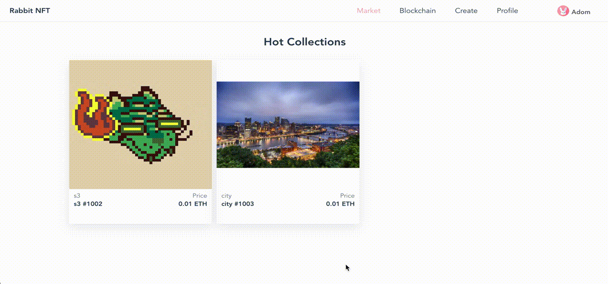

## Tulip 
Blockchain as a service base on Hyperledger Fabric


## Installation
1. create docker-compose.yaml file
```
version: "3"

networks:
  tulip:

services:
  server:
    container_name: tulip-server
    image: tulipbc/server:$SERVER_TAG
    restart: always
    environment:
      SRVCFG_ROOTDIR: $DATA_DIR
      SRVCFG_HOST: $HOST_IP
    ports:
      - 8083:8083
    networks:
      - tulip
    volumes:
      - $DATA_DIR:$DATA_DIR
      - /var/run/docker.sock:/var/run/docker.sock

  webapp:
    container_name: tulip-webapp
    image: tulipbc/webapp:$WEBAPP_TAG
    restart: always
    ports:
      - 8080:80
    networks:
      - tulip
```
2. create .env file，set docker image variables
```
# Image version
SERVER_TAG=v0.1.0
WEBAPP_TAG=v0.1.1

# Data persistence dir
DATA_DIR=/Users/stephen/tulip/example

# Docker host ip, your computer ip
HOST_IP=10.10.25.0
```
3. start containers:
```
docker-compose up -d
```

## docker container infomations
- [server container](https://hub.docker.com/r/tulipbc/server)
- [client container](https://hub.docker.com/r/tulipbc/webapp)